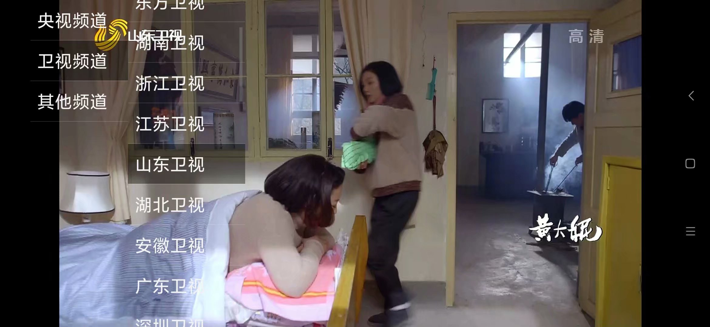

# Android 海天鹰播放器
网络直播列表，本地视频播放。  

## 更新日志
### 1.8 (2020-10-01)  
* 自动横竖屏
* 简化屏幕常亮
### 1.7 (2020-08)  
* 修复节目不能设置背景色问题（https://blog.csdn.net/peakerli/article/details/37658649,https://zhidao.baidu.com/question/262188209076803805.html）。
* 更换直播源。  
* 适配全面屏虚拟键黑色背景。
### 1.6 (2018-09-07)  
* 改动：使用Holo主题。  
* 增加：前台时禁止休眠（https://blog.csdn.net/QI_Rainbow/article/details/78203859）。
* 修复：读取剪贴板为 null 时崩溃。  
* 修复：MIUI9 从文管打开文件 path 为 null 崩溃（https://www.2cto.com/kf/201502/376975.html）。  
### 1.5 (2018-08-20)  
* 增加动态请求权限，解决 MIUI9 无法播放本地视频的问题。